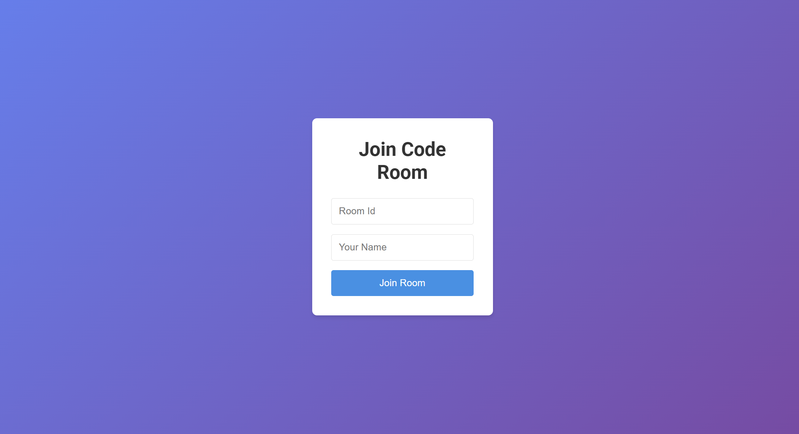

# LiveCoder AI


A real-time collaborative code editor that allows multiple users to write, compile, and understand code in shared rooms. Integrated with Google Gemini API for AI-powered code explanations and real-time session tracking with a countdown timer.


## 🚀 Features

- Real-time code collaboration using Socket.io
- AI-powered code explanations using Google Gemini API
- Live session timer per room
- Language selection and code execution using Piston API
- Typing indicators and active user tracking
- Lightweight in-memory room/user management (no database)
- Clean and responsive UI with TailwindCSS


## 🛠️ Tech Stack

**Client:** React, TailwindCSS

**Server:**  Node.js, Express, Socket.io

**API:**     Google Gemini API,Piston API


## Installation

Install my-project with npm

```bash
git clone https://github.com/your-username/your-repo-name.git
cd your-repo-name
npm install
npm start
```
🔐 Set your API keys (e.g., Gemini) in a .env file.
    
## 🧠 How It Works
- Socket.io handles real-time messaging between clients and server.

- Room Management is done via a simple in-memory Map object.

- AI Explanations are retrieved by sending code snippets to Gemini API.

- Compilation is done using Piston API, which supports multiple languages.

- UI shows live typing, room users, and results.
## 📁 Folder Structure

```bash
/client        → React frontend
/server        → Express + Socket.io backend
```
## 🧪 Sample Usage
Open the app in two tabs and join the same room ID to test real-time sync, AI explanations, and timer.

## Screenshots



## 📹 Demo Video

[](https://drive.google.com/file/d/1DmeFo3lL5M9oOWNCvWhHwDju9CRglMqW/view?usp=drive_link)


## 🔮 Future Enhancements
- Authentication and user profiles

- Persistent rooms and code saving

- Support for multiple files and tabs per room

- Improved AI interaction (chat-like interface)


## 🙌 Author
   Himanshu Tiwari
